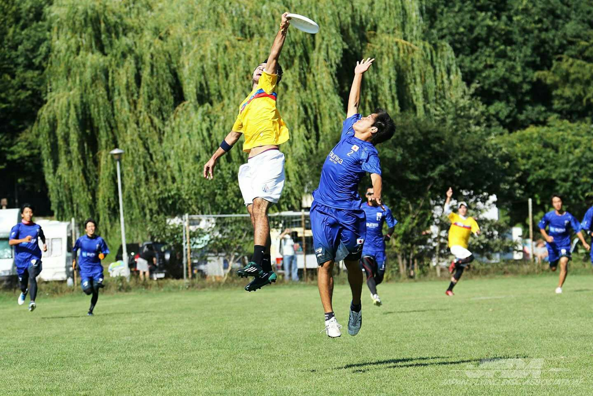
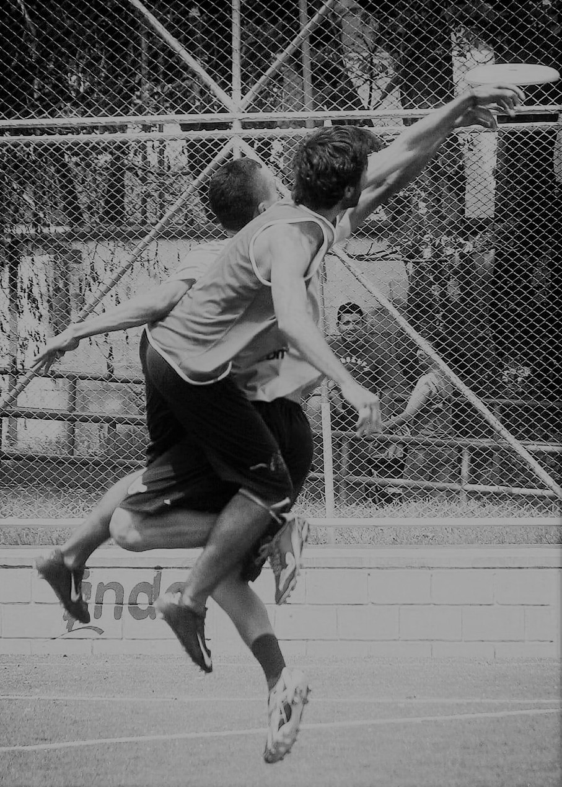

```{r setup, include=FALSE}
knitr::opts_chunk$set(echo = TRUE)
```

#¿Qué es estadística?

Se ha interrumpido la conexión
Se ha detectado un cambio de red.
ERR_NETWORK_CHANGED
“GitHub es una plataforma de desarrollo inspirada en la forma en que trabajas. Desde el código abierto hasta el del negocio, puede alojar y revisar el código, administrar proyectos y crear software junto con 28 millones de desarrolladores.” Fuente.

## Subtítulo

Este es un subtítulo.

### Subtítulo 2

Este es un subtítulo con encabezado tipo 3 (###).

#Viñetas

Las viñetas en Rmarkdown se agregan con los operadores +,- o *.

  + viñeta 1
    - Subviñeta 1.1
        * Subviñeta 1.1.1
    - Subviñeta 1.2
  + viñeta 2
  + viñeta 3

# Agregando imagen

<center>

</center>

<center>

</center>

# Hipervínculo

  - https://github.com/anframirezpe/SemilleroR_Pruebas
  - [click aquí para abrir](https://github.com/anframirezpe/SemilleroR_Pruebas)
  
# Opciones de texto

*esto es cursiva*  
**esto es negrilla**  
***esto es negrilla y cursiva***  

# Grafico ejemplo con R

```{r}
plot(iris)
```


